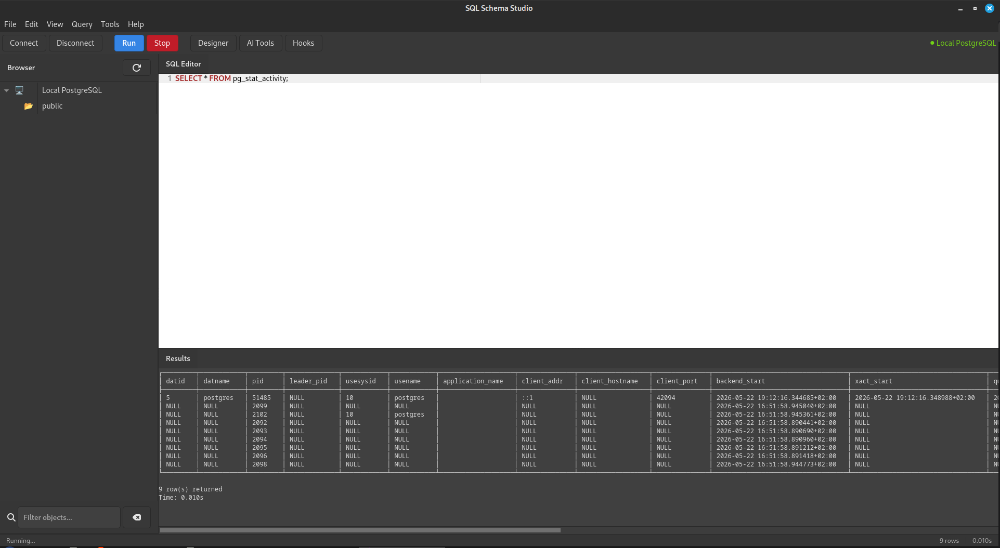

# SQL Schema Studio

[](https://www.gnu.org/licenses/gpl-3.0)
[](https://github.com/Peter-L-SVK/sql-schema-studio)
[](https://github.com/Peter-L-SVK/sql-schema-studio/releases/latest)
[](https://github.com/Peter-L-SVK/sql-schema-studio/commits/main)
<a href="https://buymeacoffee.com/leukanic.peter"></a>

SQL Schema Studio is a native GTK4 PostgreSQL client built for Linux — not Electron, not a web app.
It runs lean on any Linux desktop, extends via Python or Perl hooks, and ships a visual schema designer
without a subscription fee or a JVM. Windows users can run it via WSL2 with full GUI support through WSLg.

If you live in a terminal but want a GUI when it earns it, this is for you.

**Alpha software — under active development.**



## What It Does

Connect to PostgreSQL, browse schemas and tables, write and execute queries
with syntax highlighting, design schemas visually, and get AI-powered index
recommendations. Extend with Python and Perl hooks for custom automation.

## Current Features

- **Connection manager** with saved profiles and system keyring password storage
- **Database browser** with schema/table tree, live filtering, and double-click to query
- **SQL editor** with GtkSourceView syntax highlighting, line numbers, and F5 execution
- **Query execution** with formatted results, timing, and EXPLAIN ANALYZE support
- **File operations** — open, save, and save as for SQL files (Ctrl+O/S/Shift+S)
- **Data export** — export query results to CSV and JSON
- **Data import** — import CSV and JSON files with preview dialog
- **Visual schema designer** with drag-and-drop tables, column editor, and FK relationships
  with multiple line styles (straight, S-curve, orthogonal) and arrow heads
- **SQL file import** — drag .sql files onto the designer to reverse-engineer schemas
- **Query history** with SQLite storage, search, and type categorization
- **AI index advisor** — rule-based index recommendations for foreign keys and columns
- **Hook system** with Python and Perl plugin support and execution
- **Preferences dialog** with persistent editor settings (font, color scheme, tab width)
- **Window state persistence** — remembers size and pane positions across sessions
- Full menu bar with keyboard shortcuts, undo/redo, clipboard, SQL formatting
- Cross-desktop theming (Cinnamon, GNOME, MATE, XFCE, KDE Plasma)
- Clean shutdown with automatic disconnection

## Planned

- Completion of built-in hooks (Auto-Vacuum Advisor, Schema Anomaly Detector, Log Analyzer)
- Browse data with inline editing
- Migration generator with up/down SQL diffs
- Multi-CPU analytics for large datasets
- Visual query builder with drag-and-drop JOINs
- Bidirectional FK support with cascade rules
- Star/Snowflake schema detection and visualization
- Data normalization hook (Kebola)
- Cython optimization for heavy analytics
- User manual and documentation

## Requirements

- Linux or FreeBSD
- Windows 10/11 via WSL2
- Python 3.12 or later
- GTK 4 and GtkSourceView 5
- PostgreSQL 12 or later
- Perl 5.30 or later (optional, for Perl hooks)
- Developed on Fedora 43 Cinnamon and tested on Fedora 43 KDE Plasma 6

## System Requirements

**Debian / Ubuntu / Mint:**
```bash
sudo apt install python3-gi python3-gi-cairo gir1.2-gtk-4.0 \
  gir1.2-gtksource-5.0 libgtk-4-1 libgtksourceview-5-0 \
  libcairo2-dev python3-cairo
```

**Fedora / CentOS / RedHat:**
```bash
sudo dnf install python3-gobject gtk4 gtksourceview5 libadwaita cairo python3-cairo
```

## Quick Start

### Linux/FreeBSD

```bash
git clone https://github.com/peter-leukanic/sql-schema-studio.git
cd sql-schema-studio
pip install -r requirements.txt
python3 -m src.main
```

### Windows (WSL2)

```bash
# Install WSL2 and WSLg
wsl --install
wsl --update

# Inside WSL2 terminal (Debian / Ubuntu):
sudo apt update && sudo apt upgrade -y
sudo apt install python3-pip python3-gi python3-gi-cairo \
  gir1.2-gtk-4.0 gir1.2-gtksource-5.0 \
  libgtk-4-1 libgtksourceview-5-0 \
  libcairo2-dev python3-cairo postgresql postgresql-client -y

sudo service postgresql start

git clone https://github.com/peter-leukanic/sql-schema-studio.git
cd sql-schema-studio
pip install -r requirements.txt
python3 -m src.main
```

## Development

```bash
pip install -r requirements.txt
pip install pytest black flake8 mypy

python3 -m pytest tests/ -v
python3 -m black src/ tests/
python3 -m flake8 src/ tests/
python3 -m mypy src/
```

## Architecture

```
src/
├── main.py                     Entry point
├── app.py                      Gtk.Application lifecycle
├── actions.py                  Menu and toolbar handlers
├── config.py                   Centralized constants
├── core/                       Database connectivity, query execution, SQL parsing
├── ui/                         GTK4 interface (window, browser, editor, designer)
│   └── dialogs/                Connection, about, preferences, column editor, hooks
├── models/                     Table, column, and relationship data models
├── hooks/                      Plugin system with Python and Perl executors
│   ├── python/                 Python hook runtime
│   ├── perl/                   Perl hook runtime
│   ├── python_hooks/           Python hook implementations
│   └── perl_hooks/             Perl hook implementations
├── analytics/                  Index advisor and query analysis
├── utils/                      GTK4 helpers, logging, settings, signal handlers
└── resources/
    └── ui/
        ├── style.css           Application stylesheet
        └── icons/              Application icons
```

## Contributing

See [CONTRIBUTING](https://github.com/Peter-L-SVK/sql-schema-studio/blob/main/CONTRIBUTING.md) for details.
Please open an issue or pull request for bug fixes, feature suggestions, or documentation improvements.

## License

GNU General Public License v3 or later. See [LICENSE](LICENSE).

---
