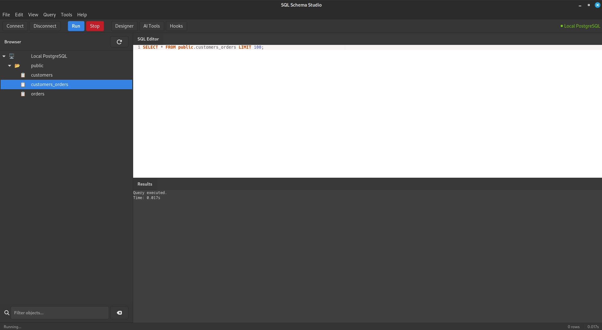
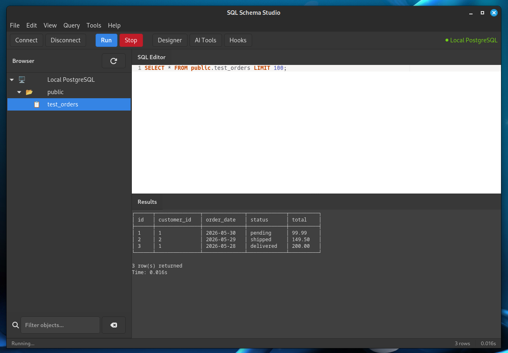

# SQL Schema studio - Visual Showcase

SQL schema generated  

Inspect table by left click on it  

List table by left double click on it  

Creation of wrong table by purpose  

Applying AI Index Advisor  

Insertion of values to it.  

List content by left double click  

Auto vacuum hook in action  

Anomaly detector finished  

Log parser in action  

After exporting all 
